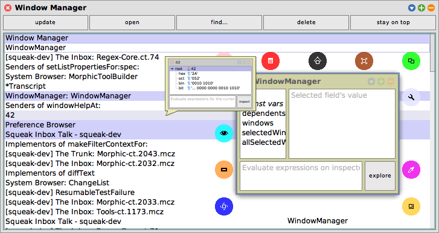

# Window Manager

A simple window manager for [Squeak](https://squeak.org).



## Installation

```smalltalk
Metacello new
	baseline: 'WindowManager';
	repository: 'github://LinqLover/squeak-windowmanager';
	get;
	load.
```
